## 📸 Gallery

### 🧪 Filters
| Filter 1 | Filter 2 | Filter 3 |
|-----------|-----------|-----------|
| 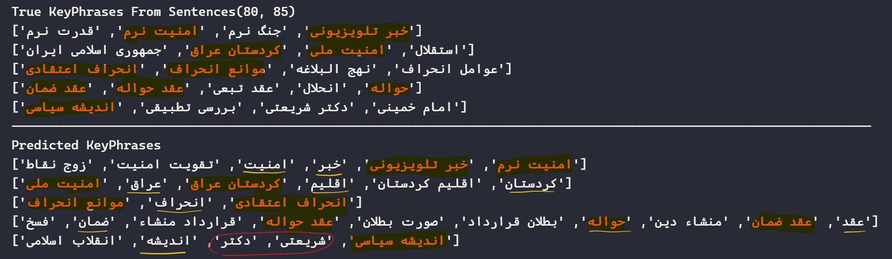 | 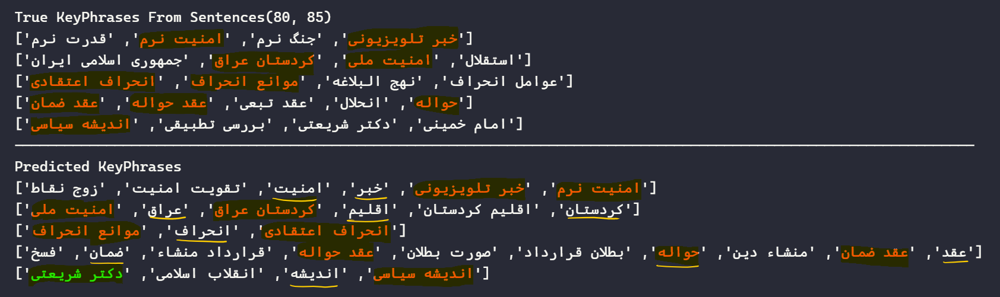 | 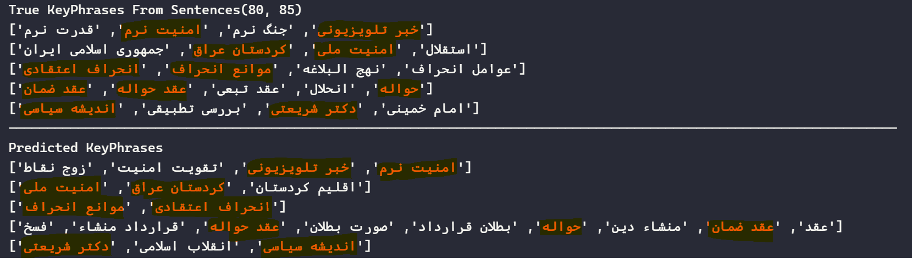 |

---

### 📊 TF-IDF Chunking Variants
| TFIDF v1 | Factor V1 | Better Filters V4 | Redundancy Removed |
|-----------|------------|-------------------|--------------------|
| 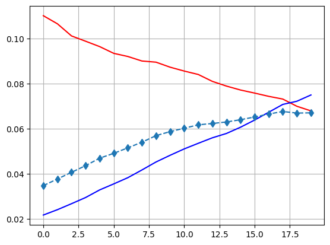 | 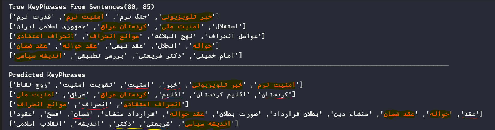 | 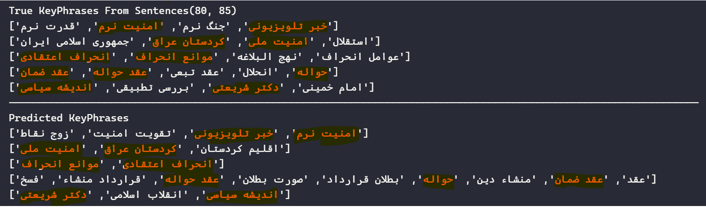 | 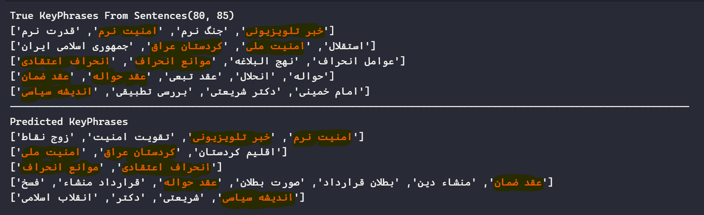 |

---

### 🧹 TF-IDF Cleaning Experiments
| Remove Duplicate Mix Ones V3 | With Named Entities | Final TF-IDF Ngrams (1,5) | Without Fixing Ngrams |
|-------------------------------|--------------------|----------------------------|------------------------|
| 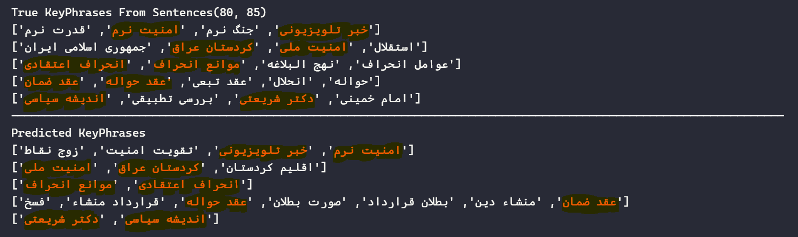 | 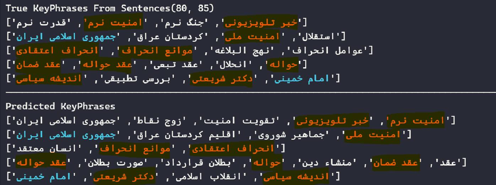 | .png) | 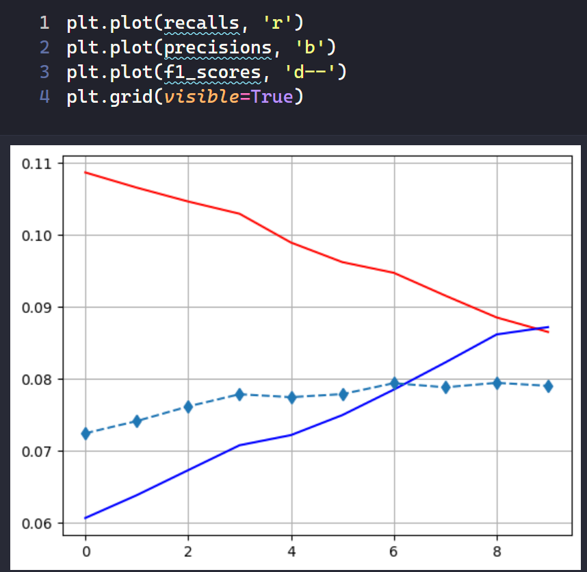 |

---

### ⚙️ Intermediate Result
| Not Good (V1) |
|---------------|
| 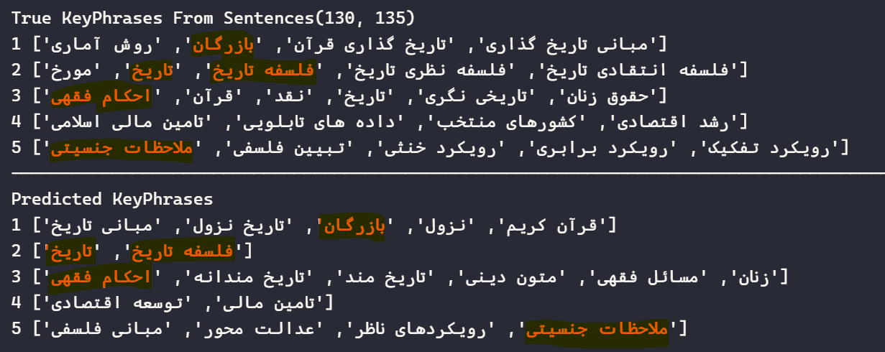 |
